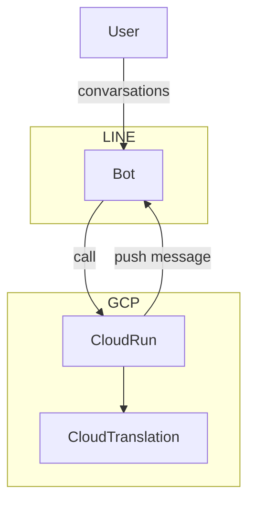

# タイ語↔日本語翻訳ボット

```mermaid
flowchart TD
    user[User] --convarsations--> bot
    subgraph GCP
        cRun[CloudRun] --> cTran[CloudTranslation]
    end
    subgraph LINE
        bot[Bot]
    end
    bot --call--> cRun
    cRun --push message--> bot

``` 